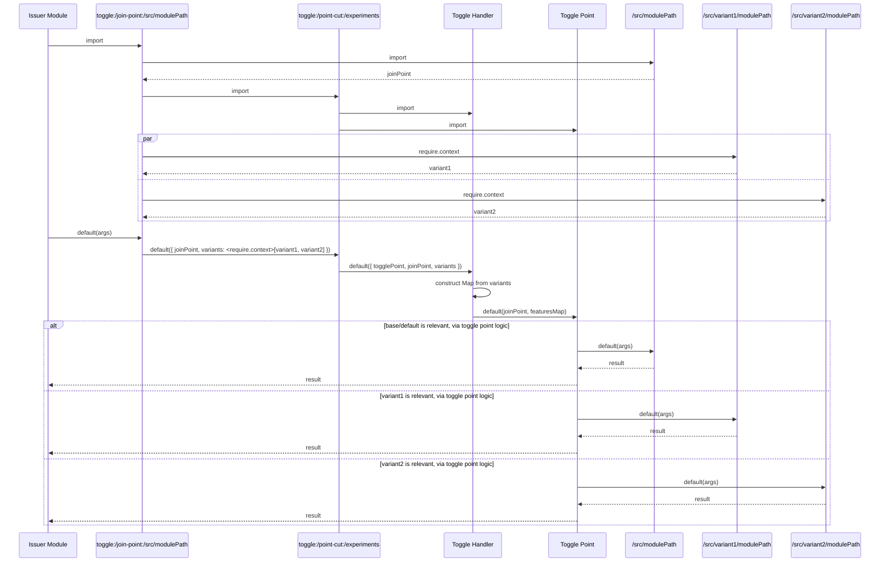

# @asos/web-toggle-point-webpack

This package provides a [webpack plugin](https://webpack.js.org/concepts/plugins/) that's designed to identify [join points](https://en.wikipedia.org/wiki/Join_point) during a build process based on a configurable filesystem convention, then re-direct requests to those modules to a proxy.  The proxy makes a decision at runtime, based on some context, to either enact the original module, or a variant.

The join points are configured as a [pointcut](https://en.wikipedia.org/wiki/Pointcut) which defines the convention to identify the join points within the input file system, and the toggle handler that should enact decisions at runtime, choosing the appropriate module to run.

The join points are configured using a [glob](https://en.wikipedia.org/wiki/Glob_(programming)) to specify the varied modules. These modules are ideally colocated next to the base/default module that will act as the join point.[^1]

- This colocation empowers a guiding principle of the project, which aims to vary code without the cost of conditional logic being introduced, yet keeping the varied code obtrusive enough that it is not overlooked when change is needed in that area of the codebase.
- The default setup implies a folder for storing varied code, so that peripheral modules used by the varied code are held out-of-sight of the base codebase, and enabling the bulk merge or removal of the variation as a whole.
  - This is born of the origins of the project being for short-term experimental toggles.  However, other schemes are possible for longer-lived toggle types.
- The default setup also implies consistent naming when varying code; in that a variation module should have the same name as the module it is varying.[^1]  Again, this is designed to lower friction when accepting a variation as the new base line.

> [!WARNING]  
> N.B. All varied modules must have a single `default` export.  Currently, named exports are not made available, and attempts to access will produce a build error. Could be enforced via [`eslint-plugin-import/no-named-export`](https://github.com/import-js/eslint-plugin-import/blob/main/docs/rules/no-named-export.md)

[^1]:The aforementioned locality / naming concerns can be subverted by supplying a custom `joinPointResolver` to the point cut configuration, allowing the join point to be located far from the variant code, and with any name transformation, should this be needed.

## Usage

### Configuration

See [JSDoc output](https://asos.github.io/web-toggle-point/module-asos-web-toggle-point-webpack.html)

Different code paths may have different toggling needs, and may want a toggle point applied in differing ways. Independent point cuts should be configured for each different:

- [toggle type](https://martinfowler.com/articles/feature-toggles.html#:~:text=feature%2Dtoggled%20system.-,Categories%20of%20toggles,-We%27ve%20seen%20the) or concern, e.g. experimentation vs configuration
  - this specifies how the variation is chosen
- toggling [advice](https://en.wikipedia.org/wiki/Advice_(programming)) required
  - this specifies what effects occur when the choice is reified & enacted

The plugin constructor takes `TogglePointInjectionOptions` thus:

```typescript
import { NormalModule } from 'webpack';

interface PointCut {
  name: string;
  togglePointModule: string;
  variantGlob?: string;
  joinPointResolver?: (variantPath: string) => string;
}

interface TogglePointInjectionOptions {
  pointCuts: PointCut[];
  toggleHandler?: string;
  webpackNormalModule?: () => typeof NormalModule;
}
```

#### Point Cuts

> [!IMPORTANT]
> N.B. when setting up multiple pointcuts, the path matched by the [globs](https://en.wikipedia.org/wiki/Glob_(programming)) must be mutually exclusive.  Otherwise, the pointcut defined earlier in the array "wins", and a warning is emitted into the compilation indicating that the subsequent cuts are neutered for those matching files.
>
> Also, due to the way Webpack works, there should only be a sinlge `TogglePointInjection` plugin per webpack configuration, so utilize the point cuts array, rather than having separate plugin instances per point cut.

#### _`name`_

Each toggling concern should be expressed in the configured `name` of the `PointCut`.  This name appears in logs and in dev tools for browser code, but otherwise can be anything.

#### _`togglePointModule`_

The module definition should be resolvable by webpack, either as a path within the codebase, or a module accessible from `node_modules` using webpack module resolution.

It's paramount that this module is compatible with the modules it is varying.  e.g.

- a toggle point that utilises browser APIs as part of making its choice or enacting side-effects should only target browser code.  
- a toggle point that utilises [React](https://react.dev/) can only toggle react code, since use of such APIs outside of the react runtime would produce a runtime error.

Also, the interface of the toggle point, and the variations that it may supplant, needs to be interchangeable with the base/default module. [Liskov Substitution Principle](https://en.wikipedia.org/wiki/Liskov_substitution_principle) must apply; functionality may differ, but it must still be compatible with all the consumers of the base module.

#### _`variantGlob`_

A [glob](https://en.wikipedia.org/wiki/Glob_(programming)) which points at varied code modules.  The default/base modules are extrapolated from this source location.[^2]

This can be as specific or generic as needed, but ideally the most specific possible for the use-cases in effect.  

It should match modules that are compatible with the `togglePointModule` - e.g. if all React code is held within a `/components` folder, it makes sense to include this in the glob path to avoid inadvertently toggling non-react code (should a variant be set up for non-React code without considering the configuration).

This glob holds the key for the naming convention approach that underpins the toggle point project, since it is the definition of the join point triggers.

If not supplied, a default `glob` of `/**/__variants__/*/*/!(*.test).{js,jsx,ts,tsx}` is used.

- this finds variant modules two folders deeper than a `__variants__`[^3] "trigger" folder.
  - the outermost folder is assumed to be a "feature" and the innermost a "variant" of that feature.
- `.test.*` files are ignored (these are assumed to be colocated unit tests)
- javascript / typescript filename extensions are assumed
  - the plugin can vary other types of file, but requires appropriate webpack loaders etc.

> [!NOTE]
> N.B. The matched files must be resolvable by webpack.

[^2]: This is done for efficiency, since the assumption is that a small proportion of modules are variations, so the plugin just seeks these out at the start of the compilation, then identifies suitable candidates for base/default module based on them.

[^3]: The double underscore aligns with a convention from jest (that used `__mocks__`) and supports natively opting-out of the filesystem conventions used by popular filesystem routing frameworks [Next.js](https://nextjs.org/) and [Remix](https://remix.run/) (rollup/vite version of this plugin to be made available in [Issue #7](https://github.com/ASOS/web-toggle-point/issues/7))

#### _`toggleHandler`_

This module unpicks the [WebPack context module](https://webpack.js.org/guides/dependency-management/#context-module-api) produced by enacting the configured `variantGlob` and converts it into a form suitable for the configured `togglePoint`.

If not supplied, a default handler (`@asos/web-toggle-point-webpack/pathSegmentToggleHandler`) is used, compatible with the default `variantGlob`, that converts the matched paths into a tree data structure held in a `Map`, with each path segment as a node in the tree, and the variant modules as the leaf nodes.

#### _`joinPointResolver`_

This marries with the `variantGlob`, in that it "undoes" the variation in file path made to the base/default module.

For every variant path found, the plugin executes this method to locate the related base/default path.

If not supplied, a default resolver is used (compatible with the default `variantGlob`), which looks three folders above for a same-named base/default module:

```js
import { resolve, basename } from "path";

export default (variantPath) => resolve(variantPath, "..", "..", "..", "..", basename(variantPath));
```

e.g. a variant at `./__variants__/feature-name/variant-name/module.js` will resolve to a base at `./module.js`.

> [!TIP]
> An "escape hatch" exists to prevent untoward convention-based variation, via creation of `__toggleConfig.json` files, sitting in the same folder as potential join points / base modules.  This can contain a `joinPoints` array, listing the filenames in the directory that should be considered eligible.  Any empty array disables all toggling for that folder. e.g.
> ```json
>{
>   "joinPoints": ["validJoinPoint.js", "anotherValidJoinPoint.js"] 
>}
>```

#### Other configuration

#### _`webpackNormalModule`_

If using [`Next.js`](https://nextjs.org/), an additional configuration parameter is needed, to inject the WebPack `NormalModule`, since the plugin is reliant on its hooks, and Next.js pre-compiles and packages Webpack, rather than referencing it as a normal package dependency.  This can be specified thus (ESM):

```js
const webpackNormalModule = async () => (await import("next/dist/compiled/webpack/NormalModule.js")).default
```

### How it Works

Given the following file structure in the repo:

```bash
├── src
│   ├── modules
│   │   ├── withTogglePoint.js
│   │   ├── myModule.js
│   │   └── __variants__
│   │       ├── feature1
│   │       │   └── variant1
│   │       │       ├── myModule.js
│   │       │       └── mySupportModule.js
│   │       └── feature2
│   │           ├── variant1
│   │           │   └── myModule.js
│   │           └── variant2
│   │               └── myModule.js
```

...and the following configuration to the plugin:

```javascript
const plugin = new TogglePointInjection({
  pointCuts: [{
    name: "my point cut",
    togglePointModule: "/src/modules/withTogglePoint",
    variantGlob: "./src/modules/**/__variants__/*/*/*.js"
  }]
});
```

...the plugin inject a proxy module with the id `toggle:/join-points:/src/modules/myModule.js` into the compilation, to which all requests for `/src/modules/myModule.js` will be redirected.[^4]

That proxy module will, in turn, import a module with id `toggle:/point-cuts:/my point cut`, and pass it the original module for `/src/modules/myModule.js` as a `pointCut` argument, plus all the possible variation modules (`./feature1/variant1/myModule.js`, `./feature2/variant1/myModule.js`, `./feature2/variant2/myModule.js`) in a [WebPack context module](https://webpack.js.org/guides/dependency-management/#context-module-api).

The `toggle:/point-cuts:/my point cut` then imports the configured toggle point (and toggle handler, if configured), then calls the handler with the toggle point, join point module, and variants. The handler is expected to unpick the webpack-specific context module, and mutate it into something consumable by the toggle point.

This toggle point is then expected to return the outcome, having chosen the appropriate module at runtime.

```javascript
const togglePoint = (joinPoint, featuresMap) => {
  if (feature2Variant1ShouldApply()) { // some bespoke logic held in the toggle point for this type of toggle
    return featuresMap.get("feature2").get("variant1").default;
  };
  return joinPoint.default;
}
```

[^4]: An exception to this would be modules that are themselves referenced, in some chain of requests, from the `toggle:/join-points:/src/modules/myModule.js` module.  This exception avoids circular references, and allows variation code to import and augment the base, supporting implementation of the [open-closed principle](https://en.wikipedia.org/wiki/Open%E2%80%93closed_principle).

#### Sequence Diagram



<script src="./mermaidJsdoc.js"></script>
